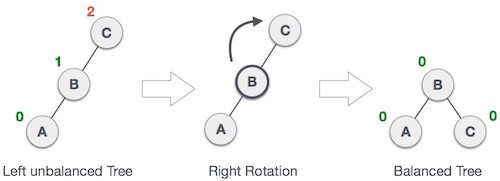

# AVL树

AVL 树是一种平衡二叉树，得名于其发明者的名字（ Adelson-Velskii 以及 Landis）。（可见名字长的好处，命名都能多占一个字母出来）。平衡二叉树递归定义如下：

1. 左右子树的高度差小于等于 1。
2. 其每一个子树均为平衡二叉树。

基于这一句话，我们就可以进行判断其一棵树是否为平衡二叉了。

## 实现原理

为了保证二叉树的平衡， AVL 树引入了所谓监督机制，就是在树的某一部分的不平衡度超过一个阈值后触发相应的平衡操作。保证树的平衡度在可以接受的范围内。

## 具体实现

既然引入了监督机制，我们必然需要一个监督指标，以此来判断是否需要进行平衡操作。这个监督指标被称为“平衡因子（Balance Factor）”。定义如下：

> **平衡因子**： 某个结点的左子树的高度减去右子树的高度得到的差值。

基于平衡因子，我们就可以这样定义 AVL 树。

> AVL 树： 所有结点的平衡因子的绝对值都不超过 1 的二叉树。

为了计算平衡因子，我们自然需要在节点中引入高度这一属性。在这里，我们把节点的高度定义为其左右子树的高度的最大值。因此，引入了高度属性的 AVL 树的节点定义如下：

```
struct node {
    int             data;
    int             height;
    struct node     *left;
    struct node     *right;
}

typedef struct node node_t;
typedef struct node* nodeptr_t;
```

定义了节点的高度属性后，我们还需要编写函数计算某一个节点的高度，借由树的递归定义，我们很容易写出这一函数。

```
int treeHeight(nodeptr_t root) {
    if(root == NULL) {
        return 0;
    } else {
        return max(treeHeight(root->left),treeHeight(root->right)) + 1;
    }
}
```

max 的定义很一般，在此不再说明。

与之对应地，我们在进行如下操作时需要更新受影响的所有节点的高度：

1. 在插入结点时， 沿插入的路径更新结点的高度值
2. 在删除结点时（delete）,沿删除的路径更新结点的高度值

有了高度，计算平衡因子的操作就得以很简单的实现：

```text
int treeGetBalanceFactor(nodeptr_t root) {
    if(root == NULL)
        return 0;
    else
        return x->left->height - x->right->height;
}
```

当平衡因子的绝对值大于 1 时，就会触发树的修正，或者说是再平衡操作。

## 树的平衡化操作

二叉树的平衡化有两大基础操作： 左旋和右旋。左旋，即是逆时针旋转；右旋，即是顺时针旋转。这种旋转在整个平衡化过程中可能进行一次或多次，这两种操作都是从失去平衡的最小子树根结点开始的(即离插入结点最近且平衡因子超过1的祖结点)。

## 右旋操作




所谓右旋操作，就是把上图中的 B 节点和 C 节点进行所谓“父子交换”。也可以看做，把B节点**提上去**，把C节点拿下来。

在仅有这三个节点时候，是十分简单的。但是当 B 节点处存在右孩子时，事情就变得有点复杂了。我们通常的操作是：**抛弃右孩子，将之和旋转后的节点 C 相连，成为节点 C 的左孩子**。这样，我们就能写出对应的代码。

```text
nodeptr_t treeRotateRight(nodeptr_t root) {
    nodeptr_t left = root->left;
    
    root->left = left->right; // 将将要被抛弃的节点连接为旋转后的 root 的左孩子
    left->right = root; // 调换父子关系

    left->height = max(treeHeight(left->left), treeHeight(left->right))+1;
    right->height = max(treeHeight(right->left), treeHeight(right->right))+1;
    
    return left;
}
```

## 左旋操作


左旋操作和右旋操作十分类似，唯一不同的就是需要将左右互换下。也可以看做，把B节点**提上去**，把A节点拿下来。

我们可以认为这两种操作是对称的。C 代码如下：

```text
nodeptr_t treeRotateLeft(nodeptr_t root) {
    nodeptr_t right = root->right;

    root->right = right->left;
    right->left = root;

    left->height = max(treeHeight(left->left), treeHeight(left->right))+1;
    right->height = max(treeHeight(right->left), treeHeight(right->right))+1;

    return right;
}
```

## 需要平衡的四种情况

1. LL 型


所谓 LL 型就是上图左边那种情况，即因为在根节点的左孩子的左子树添加了新节点，导致根节点的平衡因子变为 +2，二叉树失去平衡。对于这种情况，对节点 n 右旋一次即可。

2. RR 型


RR 型的情况和 LL 型完全对称。只需要对节点 n 进行一次左旋即可修正。

3. LR 型


LR 就是将新的节点插入到了 n 的左孩子的右子树上导致的不平衡的情况。这时我们需要的是先对 i 进行一次左旋再对 n 进行一次右旋。

4. RL 型

RL 就是将新的节点插入到了 n 的右孩子的左子树上导致的不平衡的情况。这时我们需要的是先对 i 进行一次右旋再对 n 进行一次左旋。

这四种情况的判断很简单。我们根据破坏树的平衡性（平衡因子的绝对值大于 1）的节点以及其子节点的平衡因子来判断平衡化类型。这样我们即可得出如下表格：

“犯罪节点”左孩子右孩子类型+2+1-LL+2-1-LR-2-+1RL-2--1RR

平衡化操作的实现如下：

```text
nodeptr_t treeRebalance(nodeptr_t root) {
    int factor = treeGetBalanceFactor(root);
    if(factor > 1 && treeGetBalanceFactor(root->left) > 0) // LL
        return treeRotateRight(root);
    else if(factor > 1 && treeGetBalanceFactor(root->left) <= 0) { //LR
        root->left = treeRotateLeft(root->left);
        return treeRotateRight(temp);
    } else if(factor < -1 && treeGetBalanceFactor(root->right) <= 0) // RR
        return treeRotateLeft(root);
    else if((factor < -1 && treeGetBalanceFactor(root->right) > 0) { // RL
        root->right = treeRotateRight(root->right);
        return treeRotateLeft(root);
    } else { // Nothing happened.
        return root;
    }
}
```

## AVL 树的插入和删除操作

基于上文的再平衡操作，现在我们可以写出完整的 AVL 树的插入/删除操作。

## 插入

在[上文](https://link.zhihu.com/?target=https%3A//kuso-kodo.github.io/2018/03/22/Binary-Basic/)中，我们见到了使用迭代进行的二叉搜索树的插入操作。本文使用递归的方法完成这一操作。

```text
void treeInsert(nodeptr_t *rootptr, int value)
{
    nodeptr_t newNode;
    nodeptr_t root = *rootptr;

    if(root == NULL) {
        newNode = malloc(sizeof(node_t));
        assert(newNode);

        newNode->data = value;
        newNode->left = newNode->right = NULL;

        *rootptr = newNode;
    } else if(root->data == value) {
        return;
    } else {
        if(root->data < value)
            treeInsert(&root->right,value);
        else
            treeInsert(&root->left,value)
    }

    treeRebalance(root);
}
```

基于递归，我们巧妙地将所有受影响的节点都进行了平衡。

## 删除

删除操作也一样使用了递归。

```text
void treeDelete(nodeptr_t *rootptr, int data)
{
    nodeptr_t *toFree; // 拜拜了您呐
    nodeptr_t root = *rootptr;

    if(root) {
        if(root->data == value) {
            if(root->right) {
                root->data = treeDeleteMin(&(root->right));
            } else {
                toFree = root;
                *rootptr = toFree->left;
                free(toFree);
            }
        } else {
        if(root->data < value)
            treeDelete(&root->right,value);
        else
            treeDelete(&root->left,value)
        }

        treeRebalance(root);
    }
}
```

## 练习

[陈越姥姥的题目](https://link.zhihu.com/?target=https%3A//www.patest.cn/contests/pat-a-practise/1123) 是一道不错的练习。

## 在线演示

[这里](https://link.zhihu.com/?target=https%3A//www.cs.usfca.edu/~galles/visualization/AVLtree.html)可以看到 AVL 树的可视化


# 参考

1. [详解 AVL 树（基础篇）](https://zhuanlan.zhihu.com/p/34899732)
