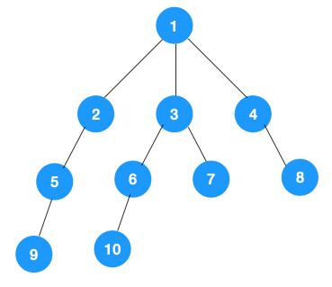
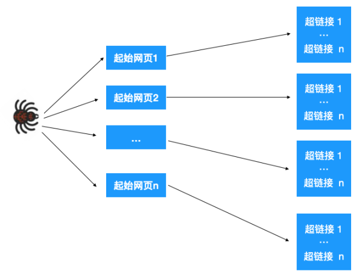

# 深度优先遍历和广度优先遍历

## 树

树是图的一种特例(连通无环的图就是树)



### DFS

深度优先遍历: 从图中一个未访问的顶点 V 开始，沿着一条路一直走到底，然后从这条路尽头的节点回退到上一个节点，再从另一条路开始走到底...，不断递归重复此过程，直到所有的顶点都遍历完成，它的特点是不撞南墙不回头，先走完一条路，再换一条路继续走。

#### 递归实现

递归实现比较简单，由于是前序遍历，所以我们依次遍历当前节点，左节点，右节点即可，对于左右节点来说，依次遍历它们的左右节点即可，依此不断递归下去，直到叶节点(递归终止条件)。

```java
public class Solution { 
    private static class Node { 
        public int value; 
        public Node left; 
        public Node right; 
 
        public Node(int value, Node left, Node right) { 
            this.value = value; 
            this.left = left; 
            this.right = right; 
        } 
    } 
 
    public static void dfs(Node treeNode) { 
        if (treeNode == null) { 
            return; 
        } 
        // 遍历节点 
        process(treeNode) 
        // 遍历左节点 
        dfs(treeNode.left); 
        // 遍历右节点 
        dfs(treeNode.right); 
    } 
} 
```

递归的表达性很好，也很容易理解，不过如果层级过深，很容易导致栈溢出。

#### 非递归实现

仔细观察深度优先遍历的特点，对二叉树来说，由于是先序遍历(先遍历当前节点，再遍历左节点，再遍历右节点)，所以我们有如下思路：

对于每个节点来说，先遍历当前节点，然后把右节点压栈，再压左节点(这样弹栈的时候会先拿到左节点遍历，符合深度优先遍历要求)。

弹栈，拿到栈顶的节点，如果节点不为空，重复步骤 1， 如果为空，结束遍历。

整体思路还是比较清晰的，使用栈来将要遍历的节点压栈，然后出栈后检查此节点是否还有未遍历的节点，有的话压栈，没有的话不断回溯(出栈)。

```java
public static void dfsWithStack(Node root) { 
    if (root == null) { 
        return; 
    } 
    Stack<Node> stack = new Stack<>(); 
    // 先把根节点压栈 
    stack.push(root); 
    while (!stack.isEmpty()) { 
        Node treeNode = stack.pop(); 
        // 遍历节点 
        process(treeNode) 
 
        // 先压右节点 
        if (treeNode.right != null) { 
            stack.push(treeNode.right); 
        } 
 
        // 再压左节点 
        if (treeNode.left != null) { 
            stack.push(treeNode.left); 
        } 
    } 
} 
```

```python
def dfs_tree_with_stack(self, root: TreeNode):
    """
    使用栈实现dfs
    """
    if not root:
        return
    stack = [root]
    while stack:
        node = stack.pop()
        self.process(node)
        if node.right:
            stack.append(node.right)
        if node.left:
            stack.append(node.left)
```

### BFS

广度优先遍历树
```java
private static void bfs(Node root) { 
    if (root == null) { 
        return; 
    } 
    Queue<Node> stack = new LinkedList<>(); 
    stack.add(root); 
 
    while (!stack.isEmpty()) { 
        Node node = stack.poll(); 
        System.out.println("value = " + node.value); 
        Node left = node.left; 
        if (left != null) { 
            stack.add(left); 
        } 
        Node right = node.right; 
        if (right != null) { 
            stack.add(right); 
        } 
    } 
} 
```

```python
def bfs_tree(self, root: TreeNode):
    if not root:
        return
    queue = [root]
    while queue:
        node = queue.pop(0)
        self.process(node)
        if node.left:
            queue.append(node.left)
        if node.right:
            queue.append(node.right)
```

### 习题演练

1. [leetcode 104](https://leetcode-cn.com/problems/maximum-depth-of-binary-tree/)，[111](https://leetcode-cn.com/problems/minimum-depth-of-binary-tree/): 给定一个二叉树，找出其最大/最小深度。 

   例如：给定二叉树 [3,9,20,null,null,15,7],

   ```
      3 
     / \ 
    9  20 
      /  \ 
     15   7 
   ```

   则它的最小深度 2，最大深度 3。

   思路: 使用深度遍历的思想，递归遍历左右子树的最大/最小深度.但在得到最小深度时，注意树某个子节点为空的情况。

   ```java
   /** 
    * leetcode 104: 求树的最大深度 
    * @param node 
    * @return 
    */ 
   public static int getMaxDepth(Node node) { 
       if (node == null) { 
           return 0; 
       } 
       int leftDepth = getMaxDepth(node.left); 
       int rightDepth = getMaxDepth(node.right); 
       return Math.max(leftDepth, rightDepth) + 1; 
   } 
    
   /** 
    * leetcode 111: 求树的最小深度 
    * @param node 
    * @return 
    */ 
   public static int getMinDepth(Node node) { 
       if (node == null) { 
           return 0; 
       } 
       int leftDepth = getMinDepth(node.left); 
       int rightDepth = getMinDepth(node.right); 
       return leftDepth && rightDepth ? Math.min(leftDepth, rightDepth) + 1 : leftDepth + rightDepth + 1; 
   } 
   ```

2. leetcode 102: 给你一个二叉树，请你返回其按层序遍历得到的节点值。(即逐层地，从左到右访问所有节点)。示例，给定二叉树：[3,9,20,null,null,15,7]。

   ```
      3 
     / \ 
    9  20 
      /  \ 
     15   7 
   ```

   返回其层次遍历结果：

   ```
   [ 
     [3], 
     [9,20], 
     [15,7] 
   ] 
   ```
   
   思路: 这道题是广度优先遍历的变种，只需要在广度优先遍历的过程中，把每一层的节点都添加到同一个数组中即可，问题的关键在于遍历同一层节点前，必须事先算出同一层的节点个数有多少(即队列已有元素个数)。
   
   使用bfs思路的代码
   
   ```python
    def levelOrder(self, root: TreeNode) -> List[List[int]]:
        if not root:
            return []
        from collections import deque
        q = deque([root])
        res = []
        while q:
            level_len = len(q)
            level = []
            while level_len > 0:
                node = q.popleft()
                level.append(node.val)
                level_len -= 1
                if node.left:
                    q.append(node.left)
                if node.right:
                    q.append(node.right)
            res.append(level)
        return res
   ```
   
   使用dfs思路的代码: 这题用 BFS 是显而易见的，但其实也可以用 DFS. 
   
   DFS 可以用递归来实现，其实只要在递归函数上加上一个「层」的变量即可，只要节点属于这一层，则把这个节点放入相当层的数组里
   
   ```python
    def levelOrder(self, root: TreeNode) -> List[List[int]]:
        """
        使用DFS的方法
        """
        travel_list = []

        def dfs(root: TreeNode, level: int):
            if not root:
                return
            if len(travel_list) < level + 1:
                travel_list.append([])
            travel_list[level].append(root.val)
            dfs(root.left, level + 1)
            dfs(root.right, level + 1)

        dfs(root, 0)
        return travel_list
   ```

### 应用

DFS，BFS 每天都大量应用在 Google, Baidu 这些搜索引擎，工作过程简单来说有三步：

**1、网页抓取**

搜索引擎通过爬虫将网页爬取，获得页面 HTML 代码存入数据库中

**2、预处理**

索引程序对抓取来的页面数据进行文字提取，中文分词，(倒排)索引等处理，以备排名程序使用

**3、排名**

用户输入关键词后，排名程序调用索引数据库数据，计算相关性，然后按一定格式生成搜索结果页面。

我们重点看下第一步，网页抓取。

这一步大致为：给爬虫分配一组起始的网页，网页里包含了很多超链接，爬虫爬取一个网页后，解析提取出这个网页里的所有超链接，再依次爬取出这些超链接，再提取网页超链接。。。，如此不断重复就能不断根据超链接提取网页。如图：



如上所示，最终构成了一张图，于是问题就转化为了如何遍历这张图，显然可以用深度优先或广度优先的方式来遍历。

如果是广度优先遍历，先依次爬取第一层的起始网页，再依次爬取每个网页里的超链接，如果是深度优先遍历，先爬取起始网页 1，再爬取此网页里的链接...，爬取完之后，再爬取起始网页 2...

实际上爬虫是深度优先与广度优先两种策略一起用的，比如在起始网页里，有些网页比较重要(权重较高)，那就先对这个网页做深度优先遍历，遍历完之后再对其他(权重一样的)起始网页做广度优先遍历。

## 总结

DFS 一般是解决连通性问题，而 BFS 一般是解决最短路径问题。

## 参考

1. [图文详解两种算法：深度优先遍历（DFS）和广度优先遍历（BFS）](https://developer.51cto.com/art/202004/614590.htm)